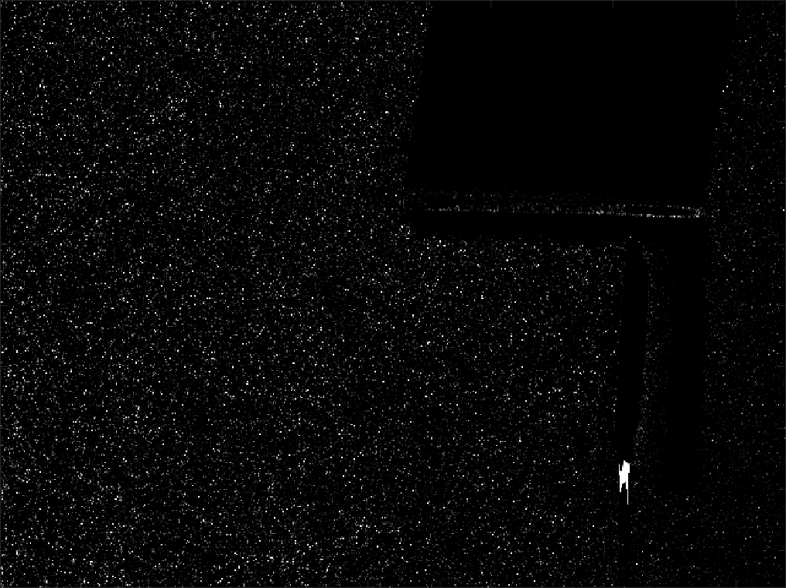
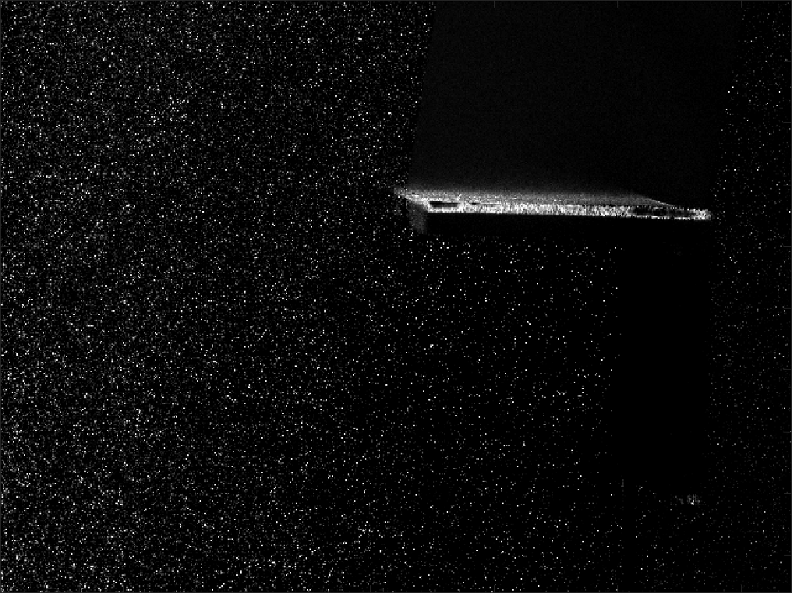

<html xmlns="http://www.w3.org/1999/xhtml" xml:lang="en">
<head>
<meta name="generator" content="jemdoc, see http://jemdoc.jaboc.net/" />
<meta http-equiv="Content-Type" content="text/html;charset=utf-8" />
<link rel="stylesheet" href="jemdoc.css" type="text/css" />
<link rel="stylesheet" href="custom.css" type="text/css" />
</head>
<body>
<table summary="Table for page layout." id="tlayout">
<tr valign="top">
<td id="layout-content">

<h1>Variable light reflection in a L-shape profile</h1>

The following example is an application of the POD-based background removal tool. The set of images is a sequence recorded at the wind tunnel facilities of the University of Bristol during a demonstration of the PIV system with students.

<table class="imgtable"><tr><td>
&nbsp;</td>
<td align="left">
First 8 sample images of the set used for this analyis.

</td></tr></table>

A total number of 1500 images was used for the background removal. For this case, using and epsilon sensitivity of 0.0001, the automatic number of modes suggested for the removal was 4.

<table class="imgtable"><tr><td>
&nbsp;</td>
<td align="left">
First 8 sample images of the set used for this analyis.

</td></tr></table>
<table class="imgtable"><tr><td>
&nbsp;</td>
<td align="left">
First 8 sample images of the set used for this analyis.

</td></tr></table>

Page generated 2017-09-19 19:12:12 GMT Daylight Time, by <a href="http://jemdoc.jaboc.net/">jemdoc</a>.

</td>
</tr>
</table>
</body>
</html>
